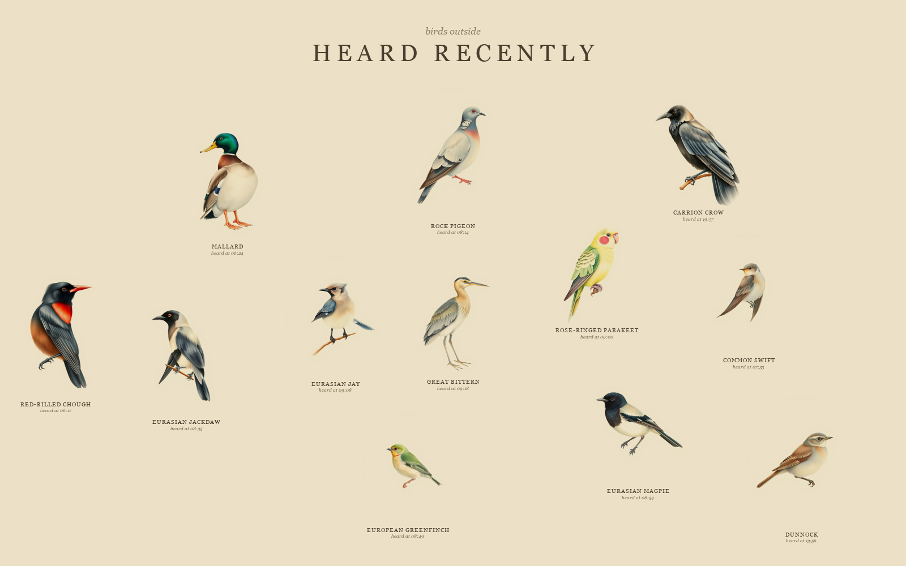

# bird-painter

**Listen to the birds outside. Watch them paint themselves onto your wall.**

bird-painter is an ambient installation for your home. A microphone listens to
the world outside your window. When a bird sings, [BirdNET](https://birdnet.cornell.edu/)
recognises the species — locally, on your machine — and a painting of that bird
appears on a full-screen "wall", rendered in a single vintage-naturalist style.
Paintings linger for a few hours, then quietly fade, so the wall is always a
picture of *what's been singing lately*.

No app. No buttons. Nothing to check. The garden writes the artwork.



<sub>Real output — every bird above was heard on a microphone, identified by
BirdNET, and painted on the spot. Assembled from a full day's detections; a
live wall holds a few hours' worth at a time.</sub>

---

## Why it's nice to live with

- **It's a window, not a feed.** The wall reflects the last few hours you
  actually lived through, not an algorithm's idea of your attention.
- **It rewards paying attention.** You start noticing the jackdaw at 08:35
  because you saw it appear.
- **It's genuinely local.** Audio never leaves the house — recognition runs on
  your own machine. The only thing that goes out is a text prompt for the
  painting.
- **It ages well.** Birds fade after a few hours, so the wall is never a
  cluttered museum. Every painting is kept on disk regardless.

## How it works

```
mic → BirdNET (local) → trigger gate → painting (FLUX via fal.ai) → archive → wall
```

**Local ears, cloud brush.** One small Python process does all of it:

- **Ears** — [BirdNET](https://birdnet.cornell.edu/) via `birdnetlib`, running
  offline on your machine. Non-bird labels (traffic, voices, insects, machines)
  are filtered out. Optionally restrict it to species plausible at your
  latitude/longitude and season.
- **Trigger gate** — a per-species cooldown plus an hourly cap, so a talkative
  robin can't flood the wall or your image bill.
- **Brush** — one stateless call to [FLUX](https://blackforestlabs.ai/) on
  [fal.ai](https://fal.ai) with a fixed house-style prompt, so every bird
  belongs to the same collection.
- **Wall** — a full-screen page served locally: a spiral collage that grows
  from the middle, birds blended into shared paper as clean cutouts, each with
  a small caption. Paintings fade in when heard and out when their time is up.

## Quickstart

```bash
python3 -m venv .venv
.venv/bin/pip install -e .
cp .env.example .env          # then put your fal.ai key in FAL_KEY
.venv/bin/python -m bird_painter
```

Open **http://127.0.0.1:8537** and leave it running on a spare screen.

On first run it will offer to pick your microphone (`--list-devices` lists
them). To run the wall without the microphone at all, set
`BP_ENABLE_LISTENER=false`.

A fal.ai key is what does the painting, so **without `FAL_KEY` the wall serves
but stays empty** — heard birds are recognised and then quietly skipped. To see
the collage before signing up for anything, drop in placeholder plates by hand:

```bash
curl -X POST http://127.0.0.1:8537/dev/paint/eurasian-jay
```

## Make it yours

Everything is an environment variable — see [`.env.example`](.env.example):

| Knob | Default | What it does |
|---|---|---|
| `BP_PAINT_TTL_SECONDS` | 3 hours | how long a bird stays on the wall (and before it can repaint) |
| `BP_CONFIDENCE_FLOOR` | 0.6 | how sure BirdNET must be — raise it if you get odd species |
| `BP_MAX_PAINTS_PER_HOUR` | 20 | hard ceiling on image generation, so a dawn chorus can't run away |
| `BP_WALL_MAX_LIVE` | 12 | how many birds the collage holds at once |
| `BP_LATITUDE` / `BP_LONGITUDE` | off | restrict BirdNET to species plausible where (and when) you are |
| `BP_INPUT_DEVICE` | system default | which microphone to listen on (index or name); essential on a headless box |
| `BP_FAL_MODEL` | `fal-ai/flux/schnell` | `fal-ai/flux/dev` follows the house-style prompt more faithfully, at a higher price |

## Hang it on the wall for real

bird-painter is built to leave the laptop: a small recorder with a microphone
outside, and an e-paper frame in the living room that just shows the collage.
The frame can't run a browser, so the app also serves the whole wall
**rendered server-side as an image at `/wall.png`** (1600×1200 by default,
configurable to your panel).

Parts list and setup notes: [`docs/hardware.md`](docs/hardware.md).

## Honest caveats

- **BirdNET mishears sometimes**, especially through glass or over traffic. A
  confidence floor and the optional location filter are your friends; a
  surprise macaw is part of the charm.
- **The painter takes artistic licence.** It won't render all ~6400 species
  faithfully — rare birds get an impression rather than a portrait.
- **A painting can just not arrive.** If the image service is slow, down, or
  out of credit, that bird is skipped and logged — nothing crashes, and the
  species simply paints the next time it's heard.
- **The archive grows forever.** Every painting is kept on disk; there's no
  pruning yet.

## Development

```bash
make review-checks    # ruff + pytest + the wall-layout tests
```

Design decisions, architecture, and the reasoning behind them live in
[`PLAN.md`](PLAN.md).

## Licenses

The **code in this repository is MIT-licensed** ([`LICENSE`](LICENSE)) — do what
you like with it.

The *running system*, though, is **for personal / non-commercial use**, because
of what it depends on:

| Component | License | Note |
|---|---|---|
| This repo's code | **MIT** | Do what you like. |
| `birdnetlib` (code) | Apache-2.0 | The Python wrapper. |
| **BirdNET models** | **CC BY-NC-SA 4.0** | **Non-commercial**, attribution, share-alike — the binding constraint. |
| **FLUX.1 [schnell]** (default) | Apache-2.0 | Commercial use permitted. |
| **FLUX.1 [dev]** (opt-in) | Non-commercial | Choosing `dev` makes image generation non-commercial too. |

Please honour those upstream licenses — BirdNET's attribution and
non-commercial terms in particular. This is a personal project, offered as-is.
